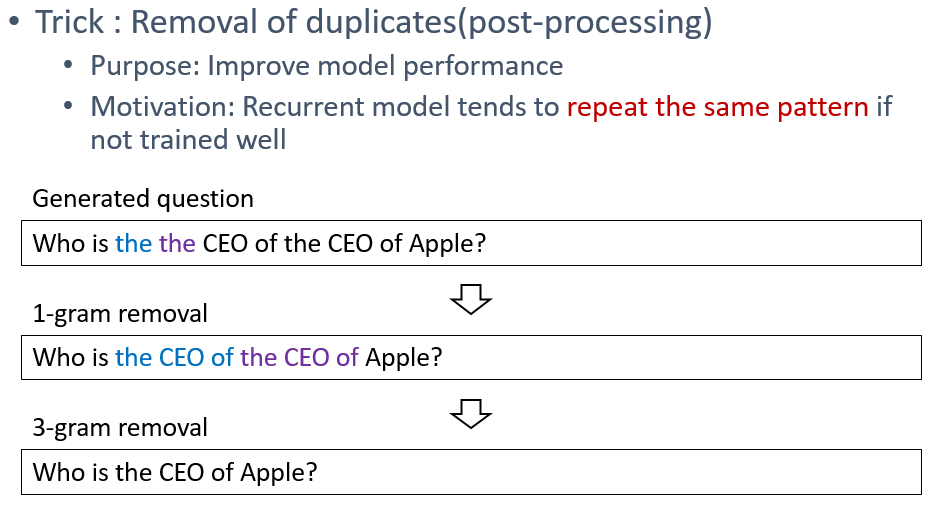

# NQG_ASs2s

Implementation of &lt;Improving Neural Question Generation Using Answer Separation> by Yanghoon Kim et al.

**The source code still needs to be modified**


1. **Model**

	- Embedding
	  - Pretrained GloVe embeddings
	  - Randomly initialized embeddings

	- Answer-separated seq2seq
	  - Answer-separated encoder
	  - Answer-separated decoder
	    - Keyword-net
		- Retrieval style word generator
	
	- Named Entity Replacement (To be updated)
	
	- Post processing
	  - Remove duplicates

2. **Dataset**

Processed data provided by [Linfeng Song et al.](https://www.aclweb.org/anthology/N18-2090)

3. **Extra tools**

    - Parameter Search

## Requirements

- python 2.7
- numpy
- Tensorflow 1.4
- nltk
- tqdm

## Usage

1. Data preprocessing

```
# Extract dataset
$ tar -zxvf data/mpqg_data/nqg_data.tgz -C data/mpqg_data

# Process data
$ cd data
$ python process_mpqg_data.py # Several settings can be modified inside the source code (data path, vocab_size, etc)
```

2. Download & process GloVe

```
$ mkdir GloVe # data/GloVe
$ wget http://nlp.stanford.edu/data/glove.840B.300d.zip -P GloVe/
$ unzip GloVe/glove.840B.300d.zip -d GloVe/
$ python process_embedding.py # This will take a couple of minutes
```

3. Run a single model

```
# Train
$ bash run.sh [dataset] train [checkpoint name] [epochs] # define dataset name inside run.sh
# EXAMPLE: $ bash run.sh squad train firstmodel 15

# Test
$ bash run.sh [dataset] pred [checkpoint name] [epochs] # enter random number in [epochs]
# EXAMPLE: $ bash run.sh squad pred firstmodel 1
```

3. (\*Optional) Parameter search(Training)

```
$ bash search_params.sh [dataset]
# EXAMPLE: $ bash search_params.sh squad

# Tip
# You can refer to the file 'assets/file_generation_for_search_params.ipynb' to automatically generate the contents of search_params.sh and params.py
```

4. (\*Optional) Remove duplicates (Post-processing)

<p align="center">

</p>

```
$ python remove_duplicates.py --source_file [predicted_file] --out_file [post_processed_file] --ngram [scalar]
# EXAMPLE: $ python remove_duplicates.py --source_file result/predictions.txt --out_file result/predictions.rmv --ngram 4
```

5. Evaluation

```
$ python qgevalcap/eval.py -out [output filename] -src [input filename(sentence)] -tgt [target filename(question)]
# EXAMPLE: $ python qgevalcap/eval.py -out result/predictions.txt -src data/processed/mpqg_substitute_a_vocab_include_a/filtered_txt/test_sentence_origin.txt -tgt data/processed/mpqg_substitute_a_vocab_include_a/filtered_txt/test_question.txt
```

## Acknowledgment
The data is adapted from [MPQG](https://github.com/freesunshine0316/MPQG). The evaluation scripts are adapted from [NQG](https://github.com/xinyadu/nqg).
